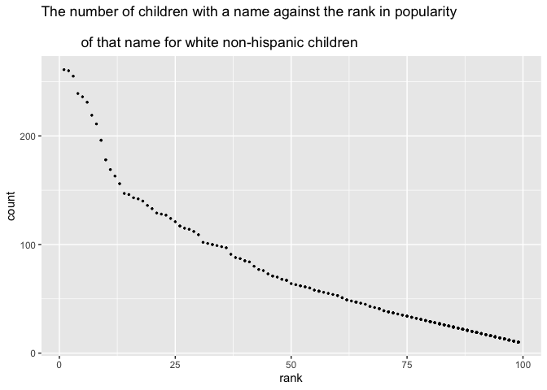

p8105\_hw2\_yw3773
================

``` r
library(readxl)
library(tidyverse)
library(constants)
```

## Problem 1

``` r
# load the manipulate the trash data.
trash_df = read_excel("./Trash-Wheel-Collection-Totals-7-2020-2.xlsx", 
                      sheet = "Mr. Trash Wheel") %>%
  janitor::clean_names() %>%
  select(dumpster:homes_powered) %>%
  drop_na(dumpster) %>%
  mutate(sports_balls = round(sports_balls))

# load and manipulate the 2018 precipitation data.
eighteen_prec = read_excel("./Trash-Wheel-Collection-Totals-7-2020-2.xlsx", 
                           sheet = "2018 Precipitation", range = "A2:B14") %>%
  drop_na() %>%
  mutate(year = 2018)
  
# load and manipulate the 2019 precipitation data.
nineteen_prec = read_excel("./Trash-Wheel-Collection-Totals-7-2020-2.xlsx", 
                           sheet = "2019 Precipitation", range = "A2:B14") %>%
  drop_na() %>%
  mutate(year = 2019)

# combine the precipitation data of 2018 and 2019.
com_prec = bind_rows(eighteen_prec, nineteen_prec) %>%
  janitor::clean_names() %>%
  mutate(month = month.name[as.numeric(month)]) 

# additional data for answering the question
nineteen_dump = trash_df %>%
  filter(year == 2019)
```

The Mr. Trash Wheel data set contains 14 columns and 454 rows. The data
sets has 14 variables which are dumpster, month, year, date,
weight\_tons, volume\_cubic\_yards, plastic\_bottles, polystyrene,
cigarette\_butts, glass\_bottles, grocery\_bags, chip\_bags,
sports\_balls, homes\_powered. The median of sports balls in a dumpster
in 2019 is 9.

The combined 2018-2019 precipitation data set contains 3 columns and 24
rows. The data set has 3 variables which are month, total, year. The
total precipitation in 2018 is 70.33.

## Problem 2

``` r
# load and manipulate the pol-month data.
pol_month_df = read_csv("./fivethirtyeight_datasets/pols-month.csv") %>%
  janitor::clean_names() %>%
  separate(mon, into = c("year", "month", "day")) %>%
  mutate(month = month.name[as.numeric(month)]) %>%
  mutate(year = as.numeric(year)) %>%
  mutate(president = ifelse(prez_dem == 0, "gop", "dem")) %>%
  select(-day, -prez_gop, -prez_dem) 

# load and manipulate the snp data.
snp_df = read_csv("./fivethirtyeight_datasets/snp.csv") %>%
  janitor::clean_names() %>%
  mutate(date, date = lubridate::mdy(date)) %>% 
  separate(date, into = c("year", "month", "day")) %>% 
  mutate(year = as.numeric(year)) %>% 
  mutate(year = ifelse(year >= 2050, year - 100, year)) %>%
  mutate(month = month.name[as.numeric(month)]) %>% 
  arrange(year, month) %>%
  select(-day)
 
# load and manipulate the unemployment data.
unemploy_df = read_csv("./fivethirtyeight_datasets/unemployment.csv") %>%
  pivot_longer(Jan:Dec, names_to = "month", values_to = "unem_percent") %>%
  janitor::clean_names() %>%
  mutate(year = as.numeric(year)) %>%
  mutate(month = month.name[match(month, month.abb)]) %>%
  arrange(year, month) 

# merge them together
merge_df = left_join(pol_month_df, snp_df, by = c("year", "month"))
merge_df = left_join(merge_df, unemploy_df, by = c("year", "month"))
```

The pol\_month data set contains 9 columns and 24 rows from 1947, 2015.
The data set has 8 variables which are year, month, gov\_gop, sen\_gop,
rep\_gop, gov\_dem, sen\_dem, rep\_dem, president.

The snp data set contains 3 columns and 787 rows from 1950, 2015. The
data set has 3 variables which are year, month, close.

The unemployment set contains 3 columns and 816 rows from 1948, 2015.
The data set has 3 variables which are year, month, unem\_percent.

The final combined data set contains 11 columns and 822 rows from 1947,
2015. The data set has 11 variables which are year, month, gov\_gop,
sen\_gop, rep\_gop, gov\_dem, sen\_dem, rep\_dem, president, close,
unem\_percent.

# Problem 3

``` r
# load and manipulate the baby name data
baby_df = read_csv("./Popular_Baby_Names.csv") %>%
  janitor::clean_names() %>%
  mutate(gender = str_to_lower(gender)) %>%
  mutate(ethnicity = str_to_lower(ethnicity)) %>%
  mutate(ethnicity = replace(ethnicity, 
                             ethnicity == "asian and pacific islander" 
                             | ethnicity == "asian and paci", 
                             "asian and pacific")) %>%
  mutate(ethnicity = replace(ethnicity, ethnicity == "white non hisp", 
                             "white non hispanic")) %>%
  mutate(ethnicity = replace(ethnicity, ethnicity == "black non hisp", 
                             "black non hispanic")) %>%
  mutate(childs_first_name = str_to_title(childs_first_name)) %>%
  unique()

# create the Olivia well-structured data.
oliva_table = baby_df %>%
  filter(childs_first_name == "Olivia") %>%
  select(-count, -gender,-childs_first_name) %>%
  pivot_wider(names_from = year_of_birth, values_from = rank)

knitr::kable(oliva_table)
```

| ethnicity          | 2016 | 2015 | 2014 | 2013 | 2012 | 2011 |
|:-------------------|-----:|-----:|-----:|-----:|-----:|-----:|
| asian and pacific  |    1 |    1 |    1 |    3 |    3 |    4 |
| black non hispanic |    8 |    4 |    8 |    6 |    8 |   10 |
| hispanic           |   13 |   16 |   16 |   22 |   22 |   18 |
| white non hispanic |    1 |    1 |    1 |    1 |    4 |    2 |

``` r
# create the most popular male baby name well-structured data.
male_table = baby_df %>%
  filter(gender == "male", rank == 1) %>%
  select(-count, -gender, -rank) %>%
  pivot_wider(names_from = year_of_birth, values_from = childs_first_name)

knitr::kable(male_table)
```

| ethnicity          | 2016   | 2015   | 2014   | 2013   | 2012   | 2011    |
|:-------------------|:-------|:-------|:-------|:-------|:-------|:--------|
| asian and pacific  | Ethan  | Jayden | Jayden | Jayden | Ryan   | Ethan   |
| black non hispanic | Noah   | Noah   | Ethan  | Ethan  | Jayden | Jayden  |
| hispanic           | Liam   | Liam   | Liam   | Jayden | Jayden | Jayden  |
| white non hispanic | Joseph | David  | Joseph | David  | Joseph | Michael |

``` r
# make the plot of "The number of children with a name against 
# the rank in popularity of that name for white non-hispanic children".
plot_df = baby_df %>%
  filter(gender == "male", ethnicity == "white non hispanic", 
         year_of_birth == 2016)

ggplot(plot_df, aes(x = rank, y = count)) + geom_point(size = 0.5) + 
  ggtitle("The number of children with a name against the rank in popularity \n 
          of that name for white non-hispanic children")
```

<!-- -->
